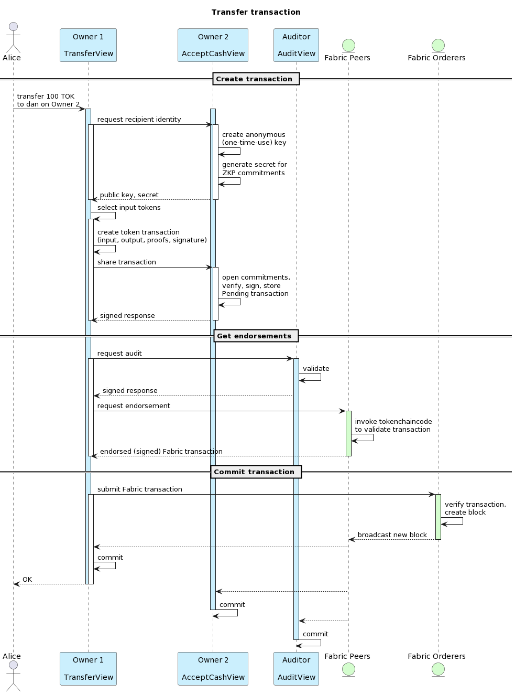

# Token SDK Sample API

This is a service with a REST API that wraps the [Token SDK](https://github.com/hyperledger-labs/fabric-token-sdk) to issue, transfer and redeem tokens backed by a Hyperledger Fabric network for validation and settlement.

Several instances of this service form a Layer 2 network that can transact amongst each other. The ledger data does not reveal balances, transaction amounts and identities of transaction parties. UTXO Tokens are owned by pseudonymous keys and other details are obscured with Zero Knowledge Proofs.

Another important point is that the application follows the new Fabric-X programming model where transactions are endorsed by applications instead of peers running chaincode.

This sample is intended to get familiar with the features of the Token SDK and as a starting point for a proof of concept. The sample contains a basic development setup with:

-   An issuer service
-   Two owner services, with wallets for Alice and Bob (on Owner 1), and Carlos and Dan (on Owner 2)
-   Two endorsers.
-   An offline Certificate Authority
-   Configuration to use a Fabric 3 test network.
-   Configuration to use a Fabric-X test network.

From now on we'll call the services for the issuer, endorsers and owners 'nodes' (not to be confused with Hyperledger Fabric peer nodes). Each of them runs as a separate application containing a REST API, the Fabric Smart Client and the Token SDK. The nodes talk to each other via a protocol called libp2p to create token transactions, and each of them also has a Hyperledger Fabric user to be able to submit the transaction to the settlement layer. The settlement layer is just any Fabric or Fabric-X network. It has to be initialized with a `token_namespace` namespace and a committed transaction with the identities of the issuer, endorsers and CA to be able to validate transactions.

## Prerequisites

### Fabric-X prerequisites

Clone the ansible scripts (anywhere on your machine):

```shell
git clone https://github.com/LF-Decentralized-Trust-labs/fabric-x-ansible-collection.git
cd fabric-x-ansible-collection
```

To use the Ansible collection, you need to have the following prerequisites installed:

- `python`;
- [`ansible`](https://docs.ansible.com/ansible/latest/installation_guide/intro_installation.html) >= **2.16**;
- [`podman`](https://podman.io/docs/installation) or [`docker`](https://docs.docker.com/engine/install/);
- [`go`](https://go.dev/doc/install).

From the fabric-x-ansible-collection directory, run:

```shell
make install
make install-prerequisites
python3 -m pip install -r ansible/requirements.txt
```

If on mac, tell the Fabric-X components to connect each other via the host.docker.internal DNS instead of localhost.

```shell
export LOCAL_ANSIBLE_HOST="host.docker.internal"
```

### Fabric 3 prerequisites

The code assumes you have the Fabric binaries in your path, and that the parent of the current folder is the fabric-samples repo. If this is not the case,

1. Download the samples and binaries:
    ```shell
    curl -sSLO https://raw.githubusercontent.com/hyperledger/fabric/main/scripts/install-fabric.sh && chmod +x install-fabric.sh
    ./install-fabric.sh docker binary
    ```
2. Either run this application from fabric-samples/token-sdk-x, or `export FABRIC_SAMPLES=/your/path/to/fabric-samples`. Optionally add it to your `~/.bashrc` or `~/.zshrc` file.


## Get started

The sample uses Fabric X as default network. If you want to run it against a sample Fabric 3 network, `export PLATFORM=fabric3` or run the commands like the following: `make setup PLATFORM=fabric`.

### Generate crypto

Create the configurations and crypto for the network.

```shell
make setup
```

### Start the network

Start the Fabric network, create the namespace, and start the application.

```shell
make start-fabric
make create-namespace
make start-app
```

Or, in short:

```shell
make start
```

### Use the application

The services are accessible on the following ports:

| api  | fsd  | service                  |
| ---- | ---- | ------------------------ |
| 8080 |      | API documentation (web)  |
| 9100 | 9101 | issuer                   |
| 9300 | 9301 | endorer 1                |
| 9400 | 9401 | endorser 2               |
| 9500 | 9501 | owner 1 (alice and bob)  |
| 9600 | 9601 | owner 2 (carlos and dan) |

Besides that, the nodes communicate with each other via 9101, 9301, 9401.

Now let's issue and transfer some tokens! View the API documentation and try some actions at [http://localhost:8080](http://localhost:8080). Or, directly from the commandline:

Initialize the token namespace (commit the parameters for the network) and issue a token:

```shell
curl -X POST localhost:9300/endorser/init # only for Fabric-X

curl http://localhost:9100/issuer/issue --json '{
    "amount": {"code": "TOK","value": 1000},
    "counterparty": {"node": "owner1","account": "alice"},
    "message": "hello world!"
}'

curl localhost:9500/owner/accounts/alice | jq
curl localhost:9600/owner/accounts/dan | jq

curl http://localhost:9500/owner/accounts/alice/transfer --json '{
    "amount": {"code": "TOK","value": 100},
    "counterparty": {"node": "owner2","account": "dan"},
    "message": "hello dan!"    
}'

curl -X GET http://localhost:9600/owner/accounts/dan/transactions | jq
curl -X GET http://localhost:9500/owner/accounts/alice/transactions | jq
```

Note that the application uses the UTXO model (like bitcoin). The issuer created a new TOK token of 1000 and assigned its ownership to alice. When alice transfered 100 TOK to dan, she used the token of 1000 as **input** for her transaction. As **output**, she creates two new tokens:

1. one for 100 TOK with dan as the owner
2. one with _herself_ as the owner for the remaining 900 TOK.

This way, each transaction can have multiple inputs and multiple outputs. Their sum should always be the same, and every new transfer must be based on previously created outputs.

#### Deep dive: what happens when doing a transfer?

It may look simple from the outside, but there's a lot going on to securely and privately transfer tokens. Let's take the example of alice (on the Owner 1 node) transfering 100 TOK to dan (on the Owner 2 node).

1. **Create Transaction**: Alice requests an anonymous key from dan that will own the tokens. She then creates the transaction, with commitments that can be verified by anyone, but _only_ be opened (read) by dan and the auditor. The commitments contain the value, sender and recipient of each of the in- and output tokens.
2. **Get Endorsements**: Alice (or more precisely the TransferView in the Owner 1 node) now submits the transaction to the auditor, who validates and stores it. The auditor _may_ enforce any specific business logic that is needed for this token in this ecosystem (for instance a transaction or holding limit).

   Alice then submits the transaction (which is now also signed by the auditor) to the Token Chaincode which is running on the Fabric peers. The chaincode verifies that all the proofs are valid and all the necessary signatures are there. Note that the peer and token chaincode cannot see what is transferred between who thanks to the zero knowledge proofs.
3. **Commit Transaction**: Alice submits the endorsed Fabric transaction to the ordering service. Alice (Owner 1), dan (Owner 2) and the Auditor nodes have been listening for Fabric events involving this transaction. When receiving the 'commit' event, they change the status of the stored transaction to 'Confirmed'. The transaction is now final; dan owns the 100 TOK.




[plantuml source](http://www.plantuml.com/plantuml/uml/TLD1JoCz3BtdLrZb0X98yEaxhTGLRA5xu50EQ0-hNZA92r6dpcpY3Eg_tsHcYDmoUvb9hFUUxHVxFh8Ed0wjOiSjmclG57SOWCj16tQUbCf_7s3nq3g32z0HjEeopHdNQM9OR3ueK-wsjALFWLyEFmOezt2n-l6qNZ_ESVuhd0TZiEELZk-LrRXvraEoZdqOMELO2JhPob18xFW8YxLkWZFmWXZYWEhA2IuU_ry_hfxEOPjWCNmYVRb8i5ekOHLGCqflOBbK6cw-bpQ_0N-wTtTx2w-Rvosn1wi9Cd3gLnLUhnc5CJKcs-Q-o3OkomRyap1o_cSR71A3isFjIiefgQCQL_bcB5kJf-F1fxYbIqzum-w0DodY5UpnAF5lI1WA8sAcCkoAuR-VNy3umy7n0OcZ2iWf47IfQPqf2jSJN5ayAOhxwa_45Ws3eouniDyZHTb0XTQQHv0qFDS-qA_19nx-NV1-5tDszqQQKy0hwLryrm6bmBzCyXsIRF1wIpq6jpkEoldBFk2MNf2iepSfENanuD12mDXvYWZdJkG9-eaCMS27Y4EMF3zJjJfPyTJvvbXwKyydarxEbTlhrjcC6AFLyzEYncpZ8jHyiYQHzNHRnflWEkhzVdeYywuT6M-nZ7ojPCwaAPE5ox6oAnZNJs9dZ5iDBoD1rRgwgwNRr6JOdEISbr-tl0PEPST9a7fvFAOHRLflze8e76g2rzReo43uCG4jVicUhPsOvqimD3r4SaZdoERvr9kpcr2IqrsL1Bfn4gsJbSCqHoWGTOzaqw7z2m00)

## Alternative: debug mode or binaries

### Run the service directly (instead of with docker-compose)

For a faster development cycle, you may choose to run the services outside of docker. It requires some adjustments to your environment to make the paths and routes work.

Add the following to your `/etc/hosts`:

```
127.0.0.1 peer0.org1.example.com
127.0.0.1 peer0.org2.example.com
127.0.0.1 orderer.example.com
127.0.0.1 issuer.example.com
127.0.0.1 endorser1.example.com
127.0.0.1 endorser2.example.com
127.0.0.1 owner1.example.com
127.0.0.1 owner2.example.com
127.0.0.1 auditor.example.com
```

> The Token SDK discovers the peer addresses from the channel config (after connecting to a configured trusted peer).


```shell
make start-fabric
make create-namespace
# don't make start-app
```

In 3 different terminals:

```shell
cd conf/issuer && go run ../../issuer --port 9100
cd conf/endorser1 && go run ../../endorser --port 9300
cd conf/owner && go run ../../owner --port 9500
```

If you use VSCode, you can also copy launch.example.json to .vscode/launch.json and run the application in debug mode.
